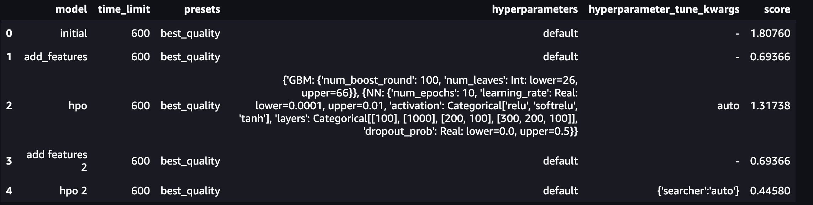

# Report: Predict Bike Sharing Demand with AutoGluon Solution
#### Priyanka Ghugare

## Initial Training
### What did you realize when you tried to submit your predictions? What changes were needed to the output of the predictor to submit your results?

Initially the dependencies installation wasnt getting completed leading to infinite download. When I upgraded kernel to MXNet 1.9 it worked as expected. Next after following the steps, filling in the missing commands creating kaggle API token, my first raw submission was submitted seamlessly.

### What was the top ranked model that performed?
WeightedEnsemble_L3 was the top ranked model. Upon adding additional features of date, month and year, the performance improved.

## Exploratory data analysis and feature creation
### What did the exploratory analysis find and how did you add additional features?
Performing EDA, below are inferences :

The features : season and weather are categorical.
The features : holiday and working day are binary values.
Datetime is a datetime object, and it is transformed to different features - day, month, year, hour, weekday.

### How much better did your model preform after adding additional features and why do you think that is?
After adding additional features, the accuracy of the model is increased significantly. This is because the new features are strongly correlated to the target.

## Hyper parameter tuning
### How much better did your model preform after trying different hyper parameters?
For first attempt, the model didnt perform better. But for the second attempt finetuning NN and GBM it did which provided me the importance of using right hypertuning parameters for further optimization.  

### If you were given more time with this dataset, where do you think you would spend more time?
Given more time I would probably look into spending time on EDA to derive new features to improve the model's prediction and experimeting with on tuning the hyper parameters to gain a deeper understanding.

### Create a table with the models you ran, the hyperparameters modified, and the kaggle score.

### Create a line plot showing the top model score for the three (or more) training runs during the project.

### Create a line plot showing the top kaggle score for the three (or more) prediction submissions during the project.

## Summary
In this assignment, I closely understood the ML life cycle from problem analysis to enginneering ML models.
EDA helped to gain insights on the data, correlated parameters and create new features from existing data.
Got introduced to AutoGluon that enables easy-to-use and easy-to-extend AutoML.I tried initial raw submission with addition of features and tuning hyperparameters. I did notice the impact of transforming datetime into day, hour, week under addition of new features. For hyperparamter tuning to notice the differences I did use default and NN and GBM finetuning arguments to analyse the results.
